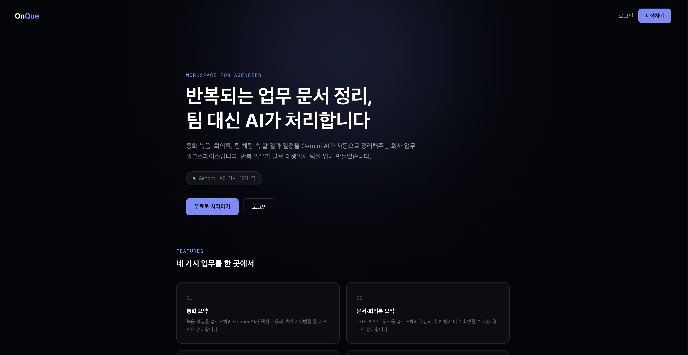
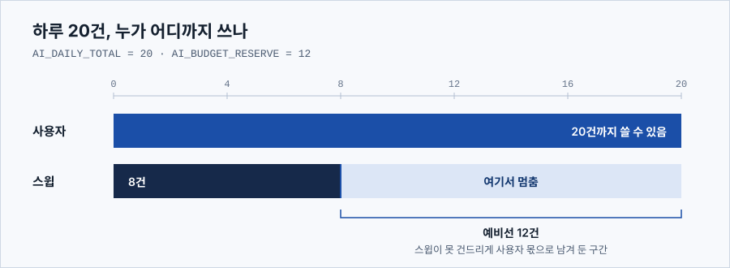

<div align="center">

# OnQue

**통화와 문서, 팀 채팅에서 할 일과 마감을 자동으로 뽑아 정리하는 업무 도구**

[](https://onque-frontend.vercel.app)
[](#테스트)
[](TROUBLESHOOTING.md)
[](docs/adr/)


진행 중인 프로젝트 · 초기 3인 팀 → 이후 단독 개발 · 2026.08.04 시작

</div>

<div align="center">



</div>

---

녹음 파일이나 문서를 올리면 AI가 요약하고, 팀 채팅에서 `@비서`를 부르면 대화를 읽어
할 일과 일정을 등록한다. 뽑힌 항목은 대시보드에서 급한 순으로 모아 보고, 각 항목이
어느 대화 어느 문장에서 나왔는지 근거를 함께 확인할 수 있다.

<div align="center">

| 커밋 | 백엔드 테스트 | 테스트 / 소스 | 트러블슈팅 | ADR |
|:---:|:---:|:---:|:---:|:---:|
| 221 | 357개 통과 | 6,674줄 / 5,577줄 | 38건 | 7건 |

</div>

## 목차

- [무엇을 하는가](#무엇을-하는가)
- [구조](#구조)
- [이 프로젝트에서 다룬 문제](#이-프로젝트에서-다룬-문제)
- [문서](#문서)
- [로컬에서 실행하기](#로컬에서-실행하기)
- [디렉터리](#디렉터리)
- [현재 상태](#현재-상태)
- [라이선스](#라이선스)

## 무엇을 하는가

| 기능 | 설명 |
|---|---|
| 통화 요약 | 녹음 파일을 올리면 콜 리포트로 정리 |
| 문서 요약 | PDF·텍스트에서 핵심만 뽑아 구조화 |
| 팀 채팅 | `@비서`가 대화를 읽고 할 일·일정을 자동 등록 |
| 약속 추적 | 통화·문서·채팅에서 나온 약속을 근거 문장과 함께 관리 |
| 대시보드 | 할 일과 약속을 급한 순으로 통합해 표시 |
| 팀 관리 | 그룹 단위 격리, 초대, 역할 관리 |

<!-- 채팅 화면 스크린샷 자리. docs/images/chat.png 로 저장하고 아래 주석을 풀면 된다.
     <div align="center"></div> -->

## 구조

프론트엔드와 백엔드를 따로 배포한다. AI 호출은 예외 없이 예산 장부를 지난다.

```
 브라우저
    │
    ▼
 Next.js 16  ──────────►  FastAPI  ──────────►  Neon Postgres
 (Vercel)                 (Render)                  │
                              │                     └─ 사용자 · 그룹 · 채팅
                              │                        약속 · 요약 · 호출 장부
                              ▼
                        AI 호출 예산 문
                        (하루 20건 배분 · 선제 차단)
                              │
                              ▼
                     Gemini 2.5 Flash
```

| 영역 | 스택 |
|---|---|
| 백엔드 | FastAPI · SQLAlchemy 2.0 · psycopg3 · Neon Postgres |
| 프론트엔드 | Next.js 16 · React 19 · TypeScript · Tailwind v4 |
| AI | Gemini 2.5 Flash (google-genai SDK) |
| 배포 | 백엔드 Render · 프론트엔드 Vercel |

## 이 프로젝트에서 다룬 문제

### 하루 20건 안에서 돌아가게 만들기

Gemini 무료 티어는 하루 20건이 전부다. 요약도 비서도 같은 한도를 쓴다.

<div align="center">



</div>

- 모든 AI 호출이 반드시 예산 검사를 거치게 강제 — 빠뜨리면 실행 자체가 안 됨
- 백그라운드 정리는 8건에서 멈추고, 남은 12건은 사용자 몫으로 확보
- 한도 소진 시 버튼을 누르기 전에 미리 차단
- 답변과 추출을 한 번의 호출로 합쳐 메시지당 소모량을 2건에서 1건으로 줄임

> 결정 근거와 버린 대안은 [ADR](docs/adr/)에 정리했다.

### 조용히 틀리는 것 잡기

에러도 없고 테스트도 다 통과하는데 실제로는 동작하지 않던 경우들을 문서로 남겼다.

| 사례 | 그때 상태 | 기록 |
|---|---|---|
| 마감일이 799일 어긋남 | 테스트 265개 전부 통과, 로그 깨끗 | [TS-035](TROUBLESHOOTING.md) |
| 안전장치가 아무것도 안 지킴 | 테스트 315개 전부 통과 | [TS-036](TROUBLESHOOTING.md) |
| 비서가 비공개 방 약속을 읽어줌 | 코드 리뷰 8회가 전부 통과 | [TS-028](TROUBLESHOOTING.md) |
| 장부는 여유 있다는데 API 한도는 끝남 | 장부 `2/20`, 실제는 소진 | [TS-038](TROUBLESHOOTING.md) |

여기서 검증 방식을 바꿨다. 통과하는 테스트를 늘리는 대신, 구현을 일부러 되돌려
그 테스트가 실제로 실패하는지 확인한다.

> [TROUBLESHOOTING.md](TROUBLESHOOTING.md)에 38건이 쌓여 있다.
> 틀린 가설과 실패한 시도를 지우지 않고 남겼다.

## 문서

| 문서 | 내용 |
|---|---|
| [트러블슈팅 기록](TROUBLESHOOTING.md) | 막힌 문제 38건. 증상·원인·시도했지만 안 된 것·해결·검증 |
| [아키텍처 결정 기록](docs/adr/) | 왜 그렇게 정했는지 7건. 버린 대안과 이유 포함 |
| [기능별 설계 문서](docs/specs/) | 기능마다 배경·설계·범위 밖·알려진 한계 (10건) |
| [구현 계획](docs/plans/) | 설계를 작업 단위로 쪼갠 것 (11건) |
| [요구 접수](docs/requirements/) | 기획 요구사항 원본 |

## 로컬에서 실행하기

<details>
<summary><b>백엔드</b></summary>

```bash
python -m venv venv
source venv/bin/activate          # Windows: venv\Scripts\activate
pip install -r requirements.txt

cp .env.example .env              # 값을 채운 뒤
uvicorn main:app --reload
```

필요한 환경변수는 `.env.example`에 있다.

| 키 | 설명 |
|---|---|
| `GOOGLE_API_KEY` | Gemini API 키 |
| `DATABASE_URL` | PostgreSQL 접속 문자열 |
| `JWT_SECRET` | 토큰 서명 키 (32자 이상) |
| `AI_DAILY_TOTAL` | 하루 AI 호출 상한 (기본 20) |
| `AI_BUDGET_RESERVE` | 사용자 몫으로 남길 예비선 (기본 12) |
| `AI_BUDGET_RESET_TZ` | 한도 리셋 기준 시간대 (기본 `America/Los_Angeles`) |

`AI_BUDGET_RESET_TZ`가 태평양인 이유는 Gemini의 하루 한도가 태평양 자정에 리셋되기
때문이다. 한국 시간으로는 오후 4시다. 실측으로 확인했다.

</details>

<details>
<summary><b>프론트엔드</b></summary>

```bash
cd onque-frontend
npm install
npm run dev
```

`NEXT_PUBLIC_API_BASE_URL`로 백엔드 주소를 지정한다.

</details>

### 테스트

```bash
pytest                            # 백엔드 357개 (28개 파일)
cd onque-frontend && npm test     # 프론트엔드 (vitest)
```

## 디렉터리

```
├── main.py                 FastAPI 진입점
├── models.py               데이터 모델
├── db.py                   DB 연결
├── call_budget.py          AI 호출 예산 장부
├── gemini_service.py       Gemini 연동 (모든 호출이 예산 문을 지남)
├── commitment_service.py   약속 추출·관리
├── permissions.py          그룹·채팅방 2단 권한 검사
├── routers/                auth · groups · commitments · assistant · announcements
├── scripts/                마이그레이션 7개, 데모 시드
├── tests/                  pytest 28개 파일
├── onque-frontend/         Next.js 앱
└── docs/
    ├── adr/                결정 기록 7건
    ├── specs/              기능별 설계 10건
    ├── plans/              구현 계획 11건
    └── requirements/       요구 접수
```

## 현재 상태

| 항목 | 상태 |
|---|---|
| 백엔드 기능 | 완료. 테스트 357개 통과 |
| 화면 디자인 개편 | 12개 화면 중 5개 전환 — `feat/ui-direction` 브랜치 |
| 배포본 | 개편 전 디자인. 브랜치를 아직 `main`에 병합하지 않음 |
| 남은 확인 | 파일 업로드가 API 한도를 소모하는지 여부 |

## 라이선스

MIT. 자세한 내용은 [LICENSE](LICENSE)에 있다.

<div align="center">

---

[라이브](https://onque-frontend.vercel.app) ·
[트러블슈팅](TROUBLESHOOTING.md) ·
[ADR](docs/adr/) ·
[설계 문서](docs/specs/)

</div>
